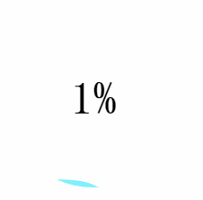
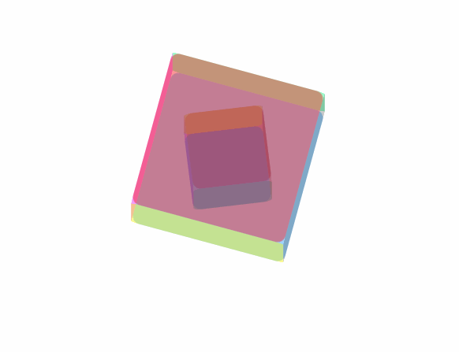
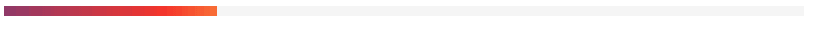
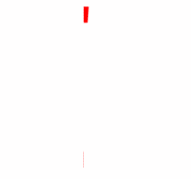

# ProgressBar Based On CSS3 & Javascript

### Ⅰ WaterWaveStyle

#### Preview


#### Usage

you may start with the initialization html or an existing html,and insert the code below into the BODY label.

```html
<div id="canvas_wave">
	<canvas id="wave" width="200" height="200"></canvas>
	<span></span>
</div>
```

of course, you can change the size of canvas,but please keep WIDTH & HEIGHT the same.Also,please import the javascript in your html, you should download the javascript file from github and import like this:

```javascript
<script type="text/javascript" src="water-wave-progress.js"></script>
```

If you want to change the ID_NAME, you just need to modify the associated code in water-wave-progress.js like this:

```javascript
var canvas_wave = document.getElementById("THE_DIV_ID_YOU_WANT");
var wave = document.getElementById("THE_CANVAS_ID_YOU_WANT");
``` 

or you want to change color of wave or of number,and number's font-family just modify javascript code below:

```javascript
var fillColor = "THE_COLOR_YOU_WANT"; // e.g. rgba(0,222,255, 0.5)
var fontColor = "THE_FONT_COLOR";
var fontfamily = "FONT_FAMILY_YOU_WANT"; // e.g. Times New Roman
```

Yeah, it's easy to use the awesome style, and be free to Pull Requests!

#### LICENSE
[LICENSE UNDER MIT]
(https://github.com/imtypist/ProgressBar/raw/master/LICENSE)

### Ⅱ InfiniteLoadingStyle


### Ⅲ BlueBarGradientStyle


### Ⅳ ColorfulStyle


### Ⅴ GreenCircleBarStyle


### Ⅵ RingLikeStyle

